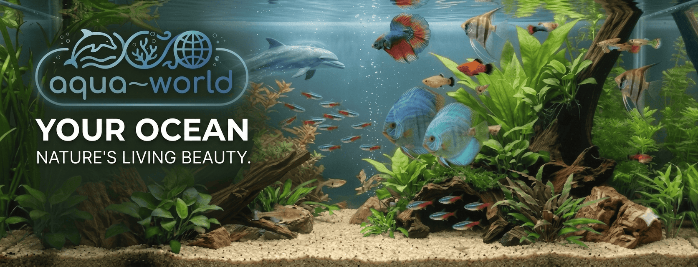

# Aqua World

Це веб-додаток для інтернет-магазину (або каталогу) акваріумних рибок та супутніх товарів. Проєкт зосереджений на зручному перегляді товарів, роботі з картками товарів та навігації.

  

## 🌐 Live Demo
Ви можете переглянути проєкт у дії за посиланням:
[https://aqua-world-two.vercel.app](https://aqua-world-two.vercel.app)

## 🛠 Технології

Проєкт побудований на сучасному стеку технологій:

- **React 19** — бібліотека для створення інтерфейсу.
- **TypeScript** — для безпеки типів та кращої підтримки коду.
- **Vite** — швидкий інструмент для збірки проєкту.
- **Bulma** — CSS-фреймворк для швидкої та адаптивної верстки.
- **SASS (SCSS)** — для стилізації та зручного керування стилями.
- **React Router Dom** — для організації навігації між сторінками.
- **Swiper** — для створення інтерактивних слайдерів (каруселей) товарів.
- **Classnames** — для зручного керування CSS-класами.

## 🚀 Основний функціонал

*   **Каталог товарів**: зручне відображення асортименту з можливістю перемикання показників (ціна, характеристики).
*   **Картки товарів**: динамічне відображення інформації (фото, назва, ціна).
*   **Навігація**: реалізована через React Router для швидкого переходу між розділами.
*   **Адаптивність**: дизайн адаптований під різні пристрої.

   
